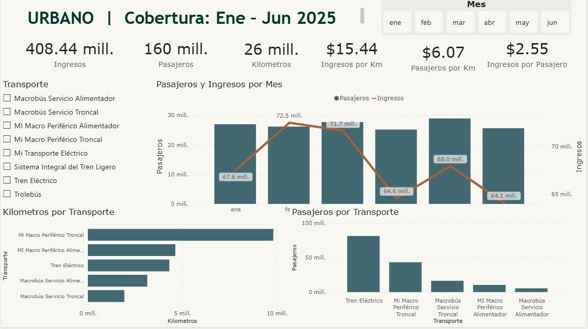

# Dashboard de Indicadores Urbanos, Económicos y Culturales — Guadalajara (Ene–Jun 2025)

## Descripción de proyectos

### 🔹 Descripción Breve
Reporte en **Power BI Desktop (.pbix)** para visualizar y analizar indicadores de tres ejes: **Urbano, Económico y Cultural**, con navegación por páginas y filtros temporales.

### 🔹 Tecnologías Utilizadas
- Power BI Desktop (reporte `.pbix`)
- DAX (medidas e indicadores)
- Power Query (M) (transformación y preparación de datos)
- Modelo tabular (DataModel embebido en PBIX)
- Visualizaciones y segmentadores (slicers, tarjetas, tablas, gráficos)
- GitHub (control de versiones y documentación)

### 🔹 Responsabilidades Clave
- Diseñé un reporte con estructura por páginas: **HOME**, **URBANO**, **ECONÓMICO**, **CULTURAL**.
- Modelé y organicé entidades para análisis, incluyendo **Calendario** para filtrado por **Mes**.
- Construí medidas e indicadores para el eje **Urbano** (p. ej., pasajeros, kilómetros, ingresos y ratios como ingreso por km/pasajero).
- Implementé análisis del eje **Económico** (unidades, actividades, % acumulado y ranking por aportación).
- Implementé análisis del eje **Cultural** (espacios culturales, distribución por tipo, habitantes por indicador y porcentajes).
- Configuré segmentadores y navegación para explorar insights por tema y periodo.
- Documenté el proyecto para facilitar su uso y despliegue en repositorio.

### 🔹 Impacto / Logros
- Centralicé en un solo reporte el seguimiento de tres ejes (**Urbano/Económico/Cultural**), reduciendo la dispersión de información.
- Estandaricé el análisis temporal con una tabla **Calendario**, facilitando comparaciones por mes.
- Mejoré la lectura de indicadores con métricas derivadas (ratios) y navegación por secciones para exploración más rápida.
- Dejé el proyecto listo para versionado en GitHub con estructura simple y documentada.

---

## Guía rápida (cómo usar)
1. Instala **Power BI Desktop**.
2. Abre el archivo: `pbix/legadoprueba.pbix`
3. Si al refrescar pide credenciales:
   - Power BI Desktop → **Transform data** → **Data source settings**
   - Actualiza rutas/credenciales y ejecuta **Refresh**

## Diccionario de datos
Consulta el diccionario aquí: `docs/data_dictionary.md`

---

## Vista del Dashboard

### HOME

### URBANO

### ECONÓMICO

### CULTURAL

